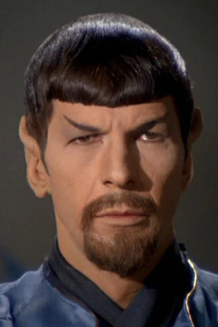

# POr qu'e usar intervalos semicerrados 

## Razones

- Técnicas
  - C lo hace asi
  - El hardware funciona asi

- Históricas
  - Los romanos/griegos no conocian el cero

En realidad, el hecho de empezar a contar en 1 se debe simplemente a razones históricas, ya
que ni los griegos ni los romanos conocían el concepto del cero. Los primeros cien años
de la era cristiana, desde el "año 1" hasta en año 100, se denominaron "siglo 1". Por eso ahora el
conjunto de años que va desde 1801 hasta 1900 se le denomina "Siglo XIX". Y por eso el
comienzo del siglo XXI no fue en el año 2000, sino en el 2001. Si hubieramos tenido un "año
cero" y un "siglo cero" los años comprendidos entre 1900 y 1999 (cien años) serían conocidos
como "Siglo Diecinueve", que es más lógico.

El cero nació en la India, pero se bautizó en Europa. Fue el matemático italiano Fibonacci
quien popularizó en Occidente el sistema decimal nacido en la India y quien comenzó a usar
la palabra **zero** para designar el símbolo de la nada. El término _sifr_, vacío en árabe,
derivó en el latín _zephyrum_, que acabó convirtiéndose en el _zefiro_ italiano y contraído
en el _zero_ veneciano, con el que Fibonacci decidió nombrar al “0”.


- Prácticas

## Ideas Falsas (o psudo-falsas)

- `range` es una funcion a la que le podemos pasar un valor de inicio y un valor final.

Falso: Lo que pasamos como segundo parametro no es un valor final, sino un valor de paraada.
Es decir, decimoe el primero de los que queremos y el primero de los que **no** queremos. Si
vemos la documentación oficial vemos que el segundo parámetro se llama `stop`, no `end`.


- Es porque C lo hace así, y por su influencia, el resto de lenguajes también

Pseudofalso, es verdad que C ha infuido a muchisimos lenguajes, pero hay lenguajes no influidos
por C que tambien idexan por 0 (Elixir, por ejemplo) y lenguajes influidos por C que indexan
en 1 (Lua está estrico en C)

- Es una decisión del lenguaje, pero no hay razones objetivas para elegir una
  sobre otra.

Falso: si que hay razones objetivas.


## Preguntas

### Implementar las cuatro opciones

¿Merece la pena dejar al programador usar todas las formas, es decir, tener una notación
como `[a, b]`, `[a, b)`, `(a, b]`, `(a, b)` o similar?

Pues no: 

- Muchas maneras de hacer las cosas (Debería habber preferiblemente solo una)

- Complica el diseño del compilador

- Se hizo ya con el lenguaje Mesa. Los usuarios se quejaron como una fuente constante
  de errores, y en las ultimas versiones se recomendaba usar solo uno de ellos

### Y dejarlo como una opción (Julia, Fortran)

Mala idea también:

- Dificultad a la hora de compartir código o librerías
- Complica el intérprete/compilador
- Visual Basic lo hace así
- Errores de tipo: "En mi ordenador funciona" dificiles de resolver.


Because it's more logical. It's more elegant, it makes more sense, it's simpler to work
with... what's not to like?

Dijkstra wrote a wonderful memo about "Why Numbering Should Start a 0" in his customarily
immaculate handwriting. I'm going to paraphrase it here, but you should read the
original—it's a bit longer, but he's a much better writer than I am!

Supongamos que queremos expresar la secuencia 2,3,4,5,6,7,8,9,10,11,12, normalmente abrebviada
como 2...12 usando solo dos números. Las posibilidades son:

A) 2 ≤ x < 13
B) 1 < x ≤ 12
C) 2 ≤ x ≤ 12
D) 1 < x < 13

Cual de estas es mas convenitnete y resultma más natural para trabajar.

Las opciones A) y B) tienen unas propiedad muy agradable, a saber, que la diferencia entre
los limites es igual al número de elementos de la secuencia y que dos secuencias adyacentes
comparten el mismo numero como limite superior / inferor

Es decir, como hay 11 elementos en la secuencia:

A) 2 ≤ x < 13  ->  13 - 2 == 11  [OK]
B) 1 < x ≤ 12  ->  12 - 1 == 11  [OK]
C) 2 ≤ x ≤ 12  ->  12 - 2 == 10 != 11 [Meh!]
D) 1 < x < 13  ->  13 - 1 == 12 != 11 [Meh!]

Y también:

para A: 

2 <= x < 7  -> 2, 3, 4, 5, 6
7 <= x < 13 -> 7, 8, 9, 10, 11, 12
2 <= x < 13 -> 2, 3, 4, 5, 6, 7, 8, 9, 10, 11, 12

es decir, en Python:

```python
range(2, 7) + range(7, 13) == range(2, 13)
```

O usando slices:

```
s = 'Hola, mundo cruel' 
s[2:7] + s[7:13] == s[2:13]
```

Para B) ocurre lo mismo

1 < x <= 7 -> 2, 3, 4, 5, 6, 7
7 < x <= 12 -> 8, 9, 10, 11, 12

1 < x <= 12 -> 2, 3, 4, 5, 6, 7, 8, 9, 10, 11, 12

Ahora, sabemos que hay un valor de índice mínimo. Usando B) o C) nos obligaría
a usar, a veces, un l'imite inferior que no se corresponde con un valor válido
para un índice. Asi que es preferible empezar en rango con $ \leq $. Además, podemos
usar el $ < $ del límite superior para describir de forma clara cuaquier secuencia vacia. Así
que la mejor opción es la A)

Bien, ahora que hemos escodigo la opcion A), ¿qué valores deberiamos usar para el 
índice? Si empzamos con el 1, la secuencia se describiria como:

$$ 1 <= x < n+1 $$

Si empezamos por cero, sería:

$$ 0 <= x < n $$

Que es más clara.

En resumen, la convencion de empezar los índices por cero no es arbitraria, ni obsoleta, ni
herencia de un lenguaje anterior (esta ultima seria, en todo caso, la de empezar por 1) ni
tampoco es un _hack_ para ahorrarnos unas cuantas operaciones: Es simplemente lo más lógico.

Todo esto lleva a una cuestión de base: Es el cero un número natural? En matemáticas parece
que la cosa no esta del todo clara, con opiniones a favor y en contra, pero en informática
es un rotundo **Si**: El conjunto ℕ contiene al 0.

Asi que el cero es parte de los n'umeros naturales, es el más pequeño de ellos, y por tanto
los 'indices empiezan en 0. Cualquier otra cosa es una tonteria y no tiene justificación
en un lenguaje moderno. Y si, esto va por R, Lua y Julia.

En terminos prácticos, además, es más fácil componer y razonar con los intervalos
semiabiertos, del tipo $a \leq x < b$. Veamos por ejemplo las siguietes propiedades:

- `len(range(n)) == n`
- `len(range(a, b)) == b - a`
- `range(a, a) == []`
- `range(a, b) + range(b, c) == range(a, c)`
- `n % m` siempre cae dentro de `range(m)`

Sin embargo, en el universo espejo de Star Trek, un universo alternativo maligno
donde Python especifica los rangos de la forma $a \leq x \leq b$, todas estas
expresiones se ensucian por múltiples $+ 1$ y $- 1$:

- `len(range(n)) = n + 1`
- `len(range(a, b)) == b - a + 1`
- `range(a, a - 1) == []`
- `range(a, b) + range(b, c) != range(a, c)`
- `n % m` *no* siempre cae dentro de `range(m)`



Veamos más ejemplos:

1) Supomgamos que tenemos una serie de números y queremos almacenarlos en $N$ _buckets_, lo más
fácil es usar un diccionario en el que usamos valores de $N$ como clave de entrada. Si el
diccionario empieza por cero --es decir, los índices de _buckets_ irán de $0$ hasta $N-1$-- el
número del _bucket_ es simplemente:

$$ bucket = number % N $$

Pero si usaramos como índices valores del $1$ an $N$, el cálculo del bucket es:

$$ bucket = (number % N) + 1 $$

2) Supongamos que queremos serializar una imagen de $w \times h$ pixels, es decir, queremos
convertirla en una lista de $w \times h$ elementos. Con índices basados en cero el pixel en
$x, y$ acaba en la posicion $y \times w + x$. Con índices basados en uno, la expresión es
$y \times w + x - w$ o $(y - 1) \times w + x$.

3) Supongamos que queremos una lista que contenga todos las letras de la `A` a la `Z`.
Tenemos la función `ord` que mapea el valor de una letra a su código ASCII. Con
índices basados en $0$, la posición de la letra c es $ ord(c) - ord('A') $. Con índices
empezando en $1$, la expresión sería $ ord(c) - ord('A') + 1 $

Vemos que los ajustes $+ 1$ y $- 1$ aparecen por todos lados, sin necesidad.


Pregunta: Cuantos días han pasdo desde el 31 de diciembre del año 1 antes de Cristo hasta el 1 de
enero del año 1DC

## Resumen

El primer número entero positivo es el $0$

## Enlaces de interes

- [Loop invariant](https://en.wikipedia.org/wiki/Loop_invariant)

- [Programming Languages where indices start from 1 (NOT 0)](https://iq.opengenus.org/array-indices-start-from-1/)

- [Así nació el cero, el número que multiplicó el poder de las matemáticas](https://www.bbvaopenmind.com/ciencia/matematicas/asi-nacio-el-cero-el-numero-que-multiplico-el-poder-de-las-matematicas/)

- [Wikipedia - Edsger Dijkstra](https://es.wikipedia.org/wiki/Edsger_Dijkstra)

- [Lenguaje MESA](https://en.wikipedia.org/wiki/Mesa_(programming_language))

- [Zero-based Numbering](https://en.wikipedia.org/wiki/Zero-based_numbering)
